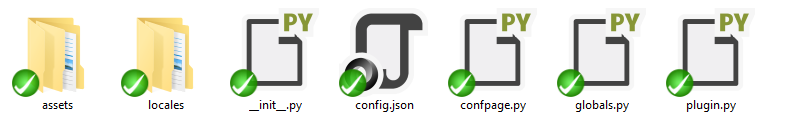
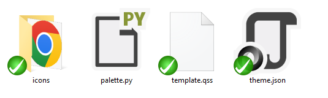

# Plugins

> Attention: the principle of operation may change during the active development of the project

<br>

## Description
Plugins are an integral part of the application, acting as full-fledged firmware, managers, complementing other plugins, etc.

<br>

## Registering and calling plugins
In order for a plugin to be registered, it must first be created. At the moment it is done manually.

In the end, you should have a plugin directory structure like this:

## Plugin's root directory


## Assets directory


Let's open the `myplugin/plugin.py` module

```py
from piekit.globals import Global
from piekit.plugins.plugins import PiePlugin
from piekit.managers.assets.mixins import AssetsAccessor
from piekit.managers.configs.mixins import ConfigAccessor
from piekit.managers.locales.mixins import LocalesAccessor


class MyPlugin(
    PiePlugin,
    ConfigAccessor,
    LocalesAccessor,
    AssetsAccessor,
):
    name = "myplugin"

    def get_plugin_icon(self) -> "QIcon":
        raise NotImpelementedError("Method `get_plugin_icon` must be implemented")

    def init(self) -> None:
        raise NotImpelementedError("Method `init` must be implemented")


def main(*args, **kwargs) -> typing.Any:
    return MyPlugin(*args, **kwargs)
```

But we'd like our plugin to do something.

First, let's override the `init` method.

```py
def init(self) -> None:
    """
    Method of plugin initialization
    """
    self.dialog = QDialog(self.parent())
    self.dialog.set_window_icon(self.get_plugin_icon())
    self.dialog.set_window_title(self.translate("My plugin"))

    self.button = QPushButton(self.getTranslation("Ok"))
    self.button.clicked.connect(self.dialog.close)

    grid_layout = QGridLayout()
    gridLayout.add_widget(self.button, 0, 0)

    self.dialog.set_layout(grid_layout)
    self.dialog.resize(400, 300)
```

Let's override the `call` method so that we can call the window when the button on the main menu is clicked.

```py
def call(self) -> None:
    self.dialog.show()
```

Let's add some logic to the `main` method

```py
def main(*args, **kwargs) -> typing.Any:
    """
    Method for configuring and running the plugin
    """

    # We can also change the value of the configuration field
    # Attention! This field may not exist at this moment
    # so it is recommended to change their values in the `init` method
    # or in a method called when the plugin is available, in which
    # this field is declared
    Global.AUDIO_EXTENSIONS.append(".wav")

    # Let's run the plugin
    return MyPlugin(*args, **kwargs)
```

Let's add a button to the `MenuBar`:

```py
@on_plugin_event(target=Plugin.MenuBar)
def _on_menu_available_(self) -> None:
    self.add_menu_item(
        section=Sections.Shared,
        menu=Menus.Help,
        name="myplugin",
        text=self.translate("Dream plugin"),
        triggered=self.dialog.show,
        icon=self.get_plugin_icon(),
    )
```

All done! Now you can make your plugin more beautiful!